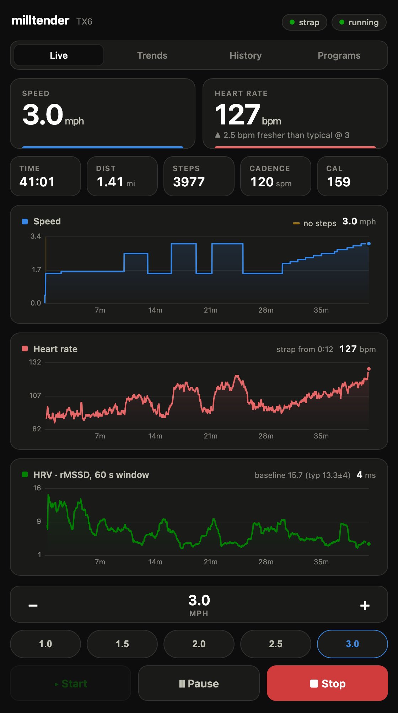
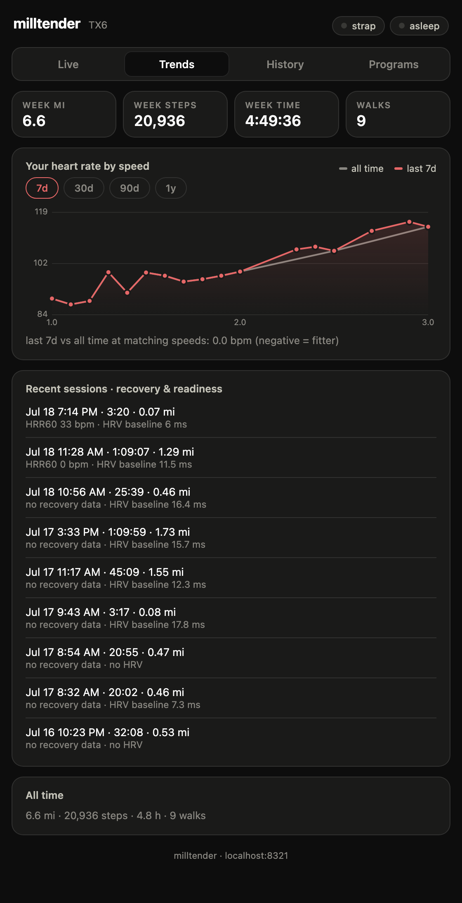
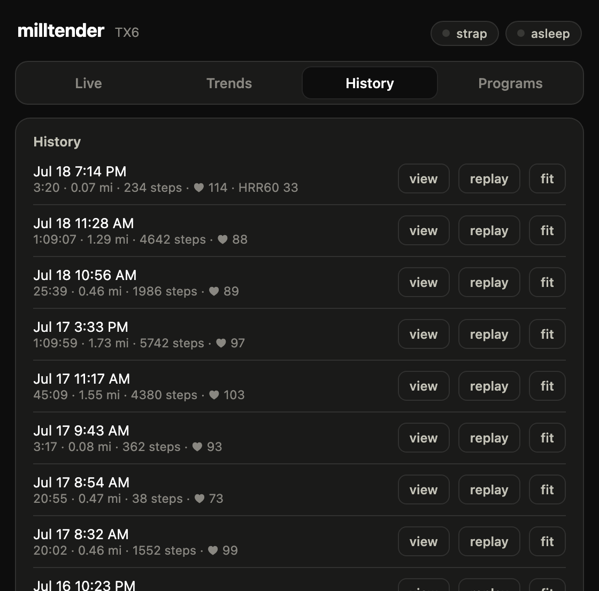

# milltender

Tends a walking treadmill. One Python daemon talks to the treadmill over
Bluetooth: it detects sessions automatically, records speed, distance, *real
step counts*, calories, heart rate, and HRV, drives the belt (speed, start/stop,
interval programs), serves a local web dashboard with live charts and fitness
trends, and — when you stop — builds a FIT file and uploads it to **Strava**
and **Garmin Connect**. No custom hardware, no phone app, no cloud account of
its own; your data lives in files on your machine.

Built for the LifeSpan TX6 Glow-Up, whose stock app deserved replacing.

<p align="center">
  
</p>
<p align="center">
  
</p>
<p align="center">
  
</p>

## Supported hardware

- **Treadmill**: any pad whose Bluetooth module speaks the FitShow protocol —
  the base advertises as `FS-…`. Developed and tested on the LifeSpan TX6
  Glow-Up (FitShow FS-BT-D2 module); other FitShow-equipped pads should work,
  possibly needing unit-calibration tweaks. The protocol details live in
  `phase0/fitshow_probe.py` and the daemon source.
- **Heart rate**: any BLE heart-rate device. A chest strap (e.g. Garmin
  HRM-Dual) provides beat-to-beat RR intervals for real HRV; a watch
  broadcasting wrist HR works too but carries no RR, so HRV stays blank.
- **Host**: a Mac or Linux box (Raspberry Pi is fine) with Bluetooth, near the
  treadmill, running Python 3.11+.

## Install

```sh
git clone https://github.com/sstjohn/milltender && cd milltender
python3 -m venv .venv && . .venv/bin/activate
pip install -r requirements.txt
```

## Connect Strava

Heads-up: **Strava requires a paid subscription to hold an API application**
(their developer-program change, effective 2026). If you subscribe:

1. Create an app at <https://www.strava.com/settings/api> — any name and
   category, website `http://localhost`, **Authorization Callback Domain
   `localhost`**, any icon.
2. Put the app's credentials in `.env` (gitignored) next to `milltender.py`:

   ```
   STRAVA_CLIENT_ID=12345
   STRAVA_CLIENT_SECRET=…
   ```

3. Run `python uploads.py strava-login`. It prints an authorization URL; open
   it, click Authorize, and paste the resulting `localhost` URL back. The
   refresh token is saved locally and rotates automatically thereafter.

## Connect Garmin

Garmin offers no hobbyist API, so milltender uses the community
[`python-garminconnect`](https://github.com/cyberjunky/python-garminconnect)
library. It works, but it lives on the unofficial side of Garmin's fence:
expect it to need updates occasionally, and weigh that against Garmin's terms
before enabling it.

1. Add to `.env`:

   ```
   GARMIN_EMAIL=you@example.com
   GARMIN_PASSWORD=…
   ```

2. Run `python uploads.py garmin-login` once. If your account has MFA you'll
   be prompted for the emailed code (running headless, drop the code into a
   `.mfa_code` file instead). Tokens are cached in `~/.garminconnect` and
   refresh themselves for about a year.

Either platform is optional: with only one configured, the other simply
reports a failed upload and the FIT file stays in `sessions/` for whenever.

## Run

```sh
python milltender.py     # dashboard on http://localhost:8321 (and your LAN)
```

Walk. That's the whole workflow: the daemon notices the belt start (even if it
started before the daemon connected — totals are reconstructed from the base's
counters), records everything, waits out a resume grace when you stop, captures
a minute of recovery heart rate, uploads, and resets for next time.

To run permanently on a Mac, edit the paths in `lol.ssj.milltender.plist`,
copy it to `~/Library/LaunchAgents/`, and
`launchctl bootstrap gui/$(id -u) ~/Library/LaunchAgents/lol.ssj.milltender.plist`.
On Linux, an equivalent systemd user service is a few lines.

## The dashboard

Four tabs: **Live** (speed/HR/HRV charts, stat tiles, belt controls with
pause, stop, and a speed stepper), **Trends** (your personal heart-rate-by-speed
curve — all-time vs. a selectable recent window — weekly volume, per-session
recovery and readiness numbers), **History** (every session, reviewable and
replayable, FIT downloads), and **Programs** (interval workouts from four
building blocks: timed holds, speed ramps, heart-rate holds, and step/distance
goals; any past session can be replayed as a program).

Reviewing a session shows a few things the upload platforms don't, computed
from the per-second data kept locally: **heart-rate recovery** after the belt
stops (HRR30/HRR60 and the exponential decay constant τ), and **aerobic
decoupling** — whether your heart worked harder at the same pace in the second
half of the walk than the first, a durability signal that holds up on a real,
variable walk because it matches on pace. Both stay quiet at easy intensities
where the signal isn't there, rather than reporting noise.

## Configuration (`.env`)

| Variable | Default | Meaning |
|---|---|---|
| `TREADMILL_ADDRESS` | (a TX6) | BLE address/UUID of your treadmill |
| `TREADMILL_NAME_PREFIX` | `FS-` | fallback discovery by name prefix |
| `HRM_ADDRESS` | `auto` | pin a heart-rate device, or auto-discover |
| `WEB_PORT` | `8321` | dashboard port |
| `MAX_MPH` | `6.0` | hard ceiling on every speed the daemon commands |
| `GRACE_S` | `180` | resume window after the belt stops before uploading |
| `RECOVERY_S` | `60` | recovery-HR capture after a deliberate stop |

The default `TREADMILL_ADDRESS` won't match your unit; discovery falls back to
scanning for the `FS-` name prefix and finds it automatically — set the address
only to pin a specific device.

`MAX_MPH` binds manual controls, programs, ramps, and HR-holds alike. It
cannot restrain the handheld remote, which talks to the base on its own radio.

## Safety

This software starts and speeds up a motorized belt. Configure `MAX_MPH` to a
speed safe for everyone with access to the dashboard, treat program start/replay
with the respect you'd give the physical controls, and keep the remote nearby.

## Data

Each session becomes a FIT file plus a JSON sidecar in `sessions/` — yours,
locally, forever, regardless of what the upload platforms do. The sidecars
power the trends and history views. Nothing leaves your machine except the
uploads you configured.

## Tests

```sh
pip install -r requirements-dev.txt
pytest
```

The suite covers the FitShow framing, the session state machine (including
each of the base's empirically discovered quirks), FIT encoding via real
encode-decode round-trips, the speed ceiling under adversarial conditions,
program validation and replay, trends aggregation, and token rotation.

## Troubleshooting

- **"treadmill unreachable" while idle is normal** — the base's Bluetooth
  sleeps ~10 minutes after use and wakes when you press start.
- **Manufacturer app conflict**: the base accepts one connection; close the
  vendor app if the daemon can't connect.
- **Watch broadcast shows "connected" but no HR arrives**: toggle the
  broadcast off and on — an unclean disconnect can wedge it.
- **HRV chart empty**: expected without a chest strap; wrist broadcasts carry
  no RR intervals.

## License

[AGPL-3.0](LICENSE).

## Prior art

- [blak3r/treadspan](https://github.com/blak3r/treadspan) — the MIT-licensed
  reverse-engineering groundwork on LifeSpan treadmills
- [pcorliss/treadmill](https://github.com/pcorliss/treadmill),
  [daeken's notes](https://gist.github.com/daeken/a3d3c4da11ca1c2d2b84) —
  earlier LifeSpan BLE work
- [cagnulein/qdomyos-zwift](https://github.com/cagnulein/qdomyos-zwift) — the
  FitShow protocol reference
